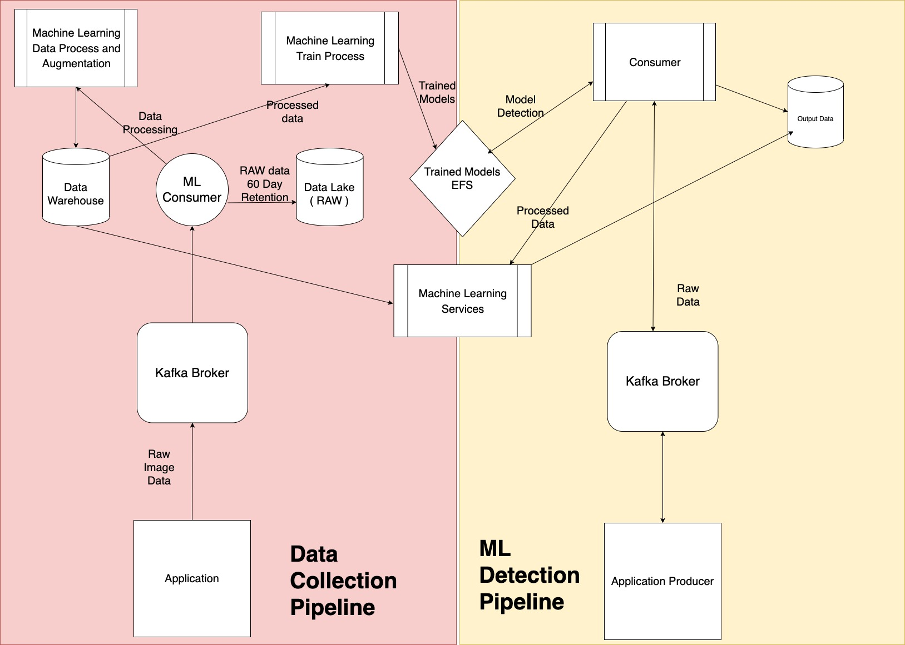

# Vector Technical Assignment

## Task 1

Task 1 focuses on using the Fashion MNIST dataset  in order to create a model and detect different fashion categories. Using Keras created a CNN running over 10 epochs. Test Accuracy is 92%. Please make sure to replace the dataset path in fashion_mnist.py if you want to pass in any alternate datasets. It is robust to any type of images as long as you follow MNIST image shape.

## Task 2

Task 2 is used to deploy a Messaging Queue Broker API, that uses Kafka and Google PUB/SUB. The service was created using one of the fastest python framework FASTAPI as the rest framework. Please replace placeholders with the Kafka Broker and Topic Names and Keys and Google Project Key and ID. API is dockerized for ease of deployment either using Kubernetes or ECS.

## Task 3

Building a robust system combining both, the appropriate architecture for this is shown as below.

Making use of producer on the application side to send the images to the Kafka Broker and consumer for processing and detecting from the ML models and services. Do note -> Prediction from models is a blocking process. However, speed to return response can be  improved in infrastructure side.

The final output from ML services is returned and stored into the DB.

